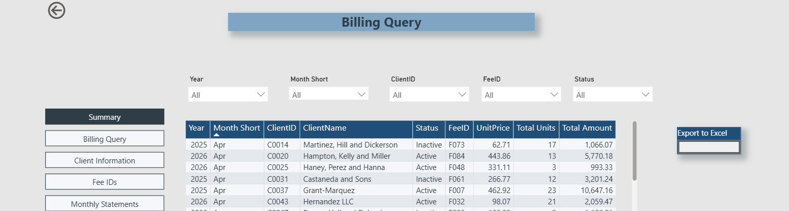
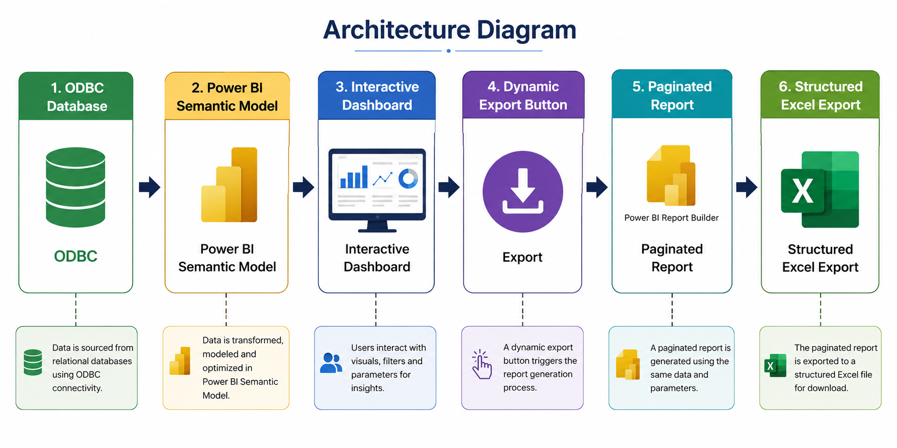
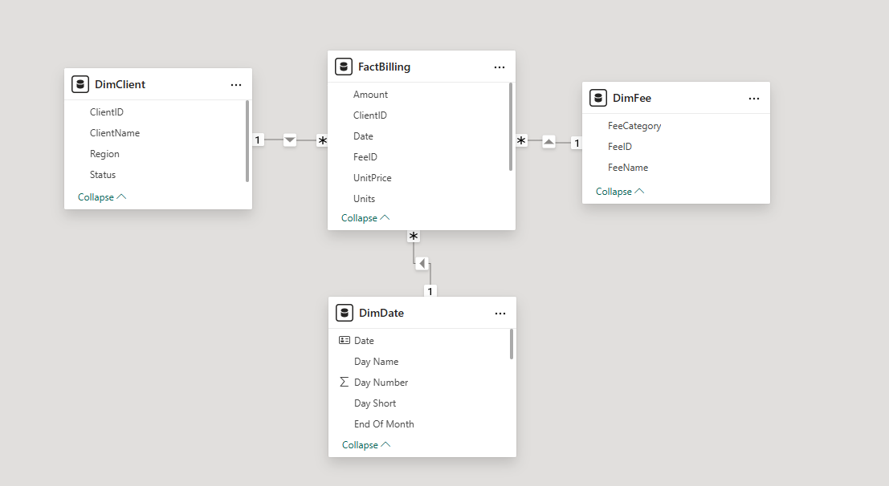
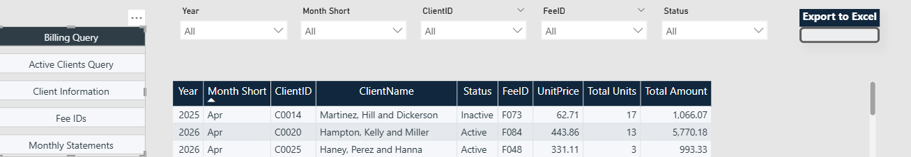
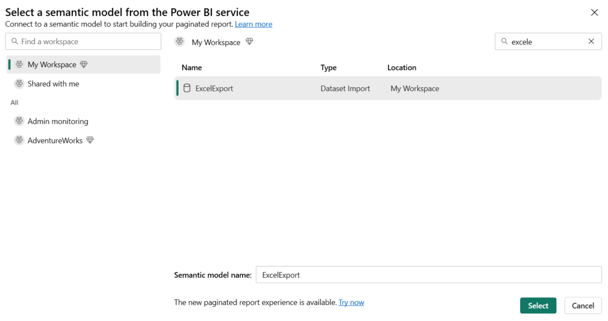
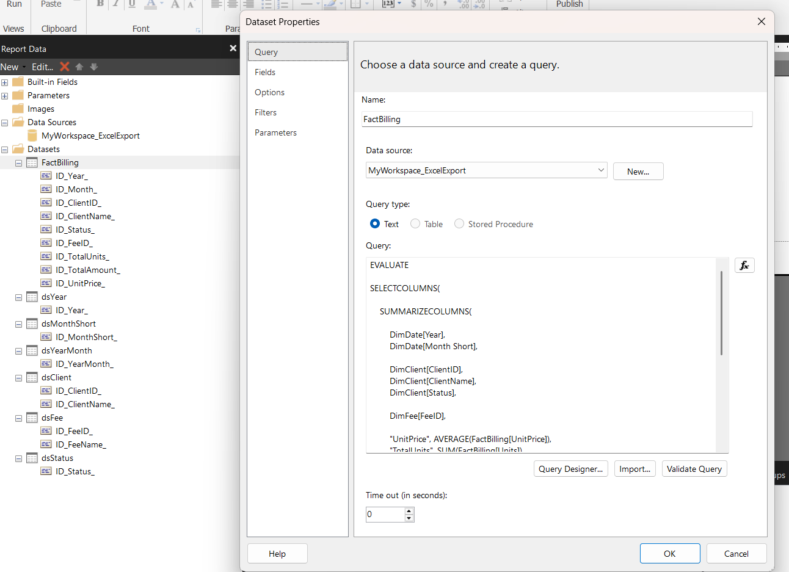
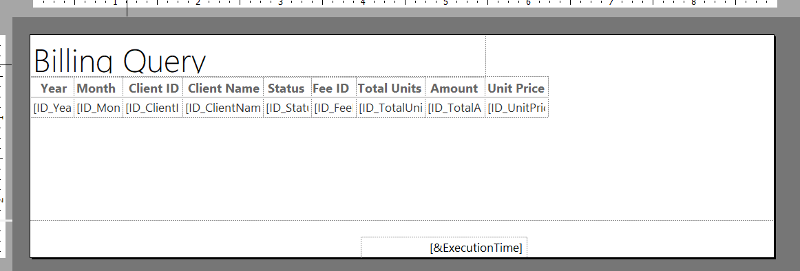
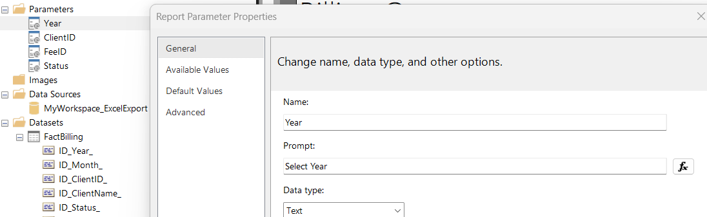

# Power BI Paginated Excel Export Solution – Technical Documentation

## 1. Executive Summary
This project presents an enterprise-style Power BI export solution designed to support operational reporting needs that go beyond standard dashboard interaction. The solution combines an ODBC-connecte[...]

The goal was to provide users with a reporting process that preserves data quality, formatting, and usability while maintaining centralized governance through the Power BI semantic model.



---

## 2. Business Problem
Standard Power BI exports were not sufficient for the operational reporting requirements of end users. While dashboards supported filtering and analysis, the exported output often required additional [...]

Challenges included:
- inconsistent export structure
- formatting issues in Excel
- repeated manual cleanup
- limited suitability for recurring operational reporting

This solution was designed to eliminate those pain points through a more controlled export mechanism.

---

## 3. Solution Architecture
The architecture follows this workflow:

**ODBC Database → Power BI Semantic Model → Interactive Dashboard → Dynamic Export Button → Paginated Report → Structured Excel Export**

This design supports both interactive analytics and structured operational exports while keeping business logic centralized.



---

## 4. ODBC Connection Setup
The first step in the solution was establishing an ODBC connection to the source database.

### Setup activities
- configure the required ODBC driver
- establish source connectivity
- import selected tables into Power BI
- validate field types and imported data
- confirm refresh behavior

### Key considerations
- import only required data elements
- confirm source reliability before report development
- standardize naming conventions during ingestion

---

## 5. Power BI Semantic Model
A star schema was used to support efficient reporting and reusable business logic.

### Core model components
- **Fact table:** `FactBilling`
- **Dimension tables:** `DimDate`, `DimClient`, `DimFee`

### Benefits
- centralized definitions for business measures
- reusable modeling layer for both dashboards and paginated reports
- improved maintainability and report consistency
- stronger governance than direct report-to-database connections



---

## 6. Dashboard Design
The dashboard was designed with operational users in mind.

### Design objectives
- expose key slicers clearly
- support analysis before export
- provide a simple, visible export button
- reduce friction between dashboard review and report extraction

### Main elements
- slicers for report filtering
- summary visuals
- detail visuals
- export action linked to the paginated report




---

## 7. Paginated Report Setup
Power BI Report Builder was used to configure the paginated export component.

### Configuration steps
- connect to the Power BI semantic model
- define report data source
- create export dataset
- configure report layout
- bind parameters
- test Excel rendering

Paginated reports were chosen because they provide stronger control over tabular layout and export formatting than standard Power BI dashboard exports.






---

## 8. DAX Query Design
The export dataset was driven by a DAX query designed to produce a clean, flattened result set.

### Sample DAX Query
```DAX
EVALUATE

SELECTCOLUMNS(

    SUMMARIZECOLUMNS(

        DimDate[Year],
        DimDate[Month Short],

        DimClient[ClientID],
        DimClient[ClientName],
        DimClient[Status],

        DimFee[FeeID],

        "UnitPrice", AVERAGE(FactBilling[UnitPrice]),
        "TotalUnits", SUM(FactBilling[Units]),
        "TotalAmount", SUM(FactBilling[Amount])

    ),

    "Year", DimDate[Year],
    "Month", DimDate[Month Short],
    "ClientID", DimClient[ClientID],
    "ClientName", DimClient[ClientName],
    "Status", DimClient[Status],
    "FeeID", DimFee[FeeID],
    "TotalUnits", [TotalUnits],
    "TotalAmount", [TotalAmount],
    "UnitPrice", [UnitPrice]

)
```

### Query rationale
- `SUMMARIZECOLUMNS` groups the required business dimensions
- aggregate calculations produce export-ready measures
- `SELECTCOLUMNS` shapes the output for downstream Excel use


---

## 9. Parameter Configuration
Parameters were configured to make the export dynamic and reusable.

### Parameter examples
- Year
- Month
- Client
- Status
- Fee

### Implementation notes
- parameter datasets populated selectable values
- “ALL” logic supported optional filtering
- dataset filters aligned report results to user selections

This made the report flexible while preserving a controlled export structure.


---

## 10. Excel Export Validation
Validation ensured the final export met operational needs.

### Validation steps
- confirm consistent headers
- verify date formatting
- verify numeric and currency formatting
- compare totals and row counts
- test filtered scenarios
- review edge cases and null handling

The final export was designed to be immediately usable with minimal or no post-processing.


---

## 11. Power BI Service Deployment
The semantic model and paginated report were published to Power BI Service.

### Deployment activities
- publish the Power BI report and dataset
- publish the paginated report
- configure credentials and refresh
- validate permissions
- test report execution in workspace

### Deployment considerations
- workspace access
- refresh stability
- user navigation from dashboard to export
- governed access through the semantic layer


### Best Practice Structure
Workspace: Dev
Workspace: Test
Workspace: Prod

Prod App:
- Dashboard
- Paginated Excel Export Report
- Instructions page

### Multi-User Deployment Best Practices

This solution can support multiple end users through a shared semantic model, shared dashboard, and parameter-driven paginated report.

Each user should access the solution through a Power BI App rather than direct workspace access. Users select filters in the dashboard and use the export button to open the paginated report with the selected parameter values.

For secure user-specific data access, Row-Level Security should be applied in the semantic model. This ensures users only see data they are authorized to view, both in the dashboard and in the exported Excel report.

Recommended setup:
- one governed semantic model
- one main dashboard
- one reusable paginated report
- parameter-based filtering
- Power BI App distribution
- security groups for access control
- Row-Level Security for user-specific data
- validation of exported Excel files by user role

Avoid creating separate copies of the same report for each user unless the layout, data logic, or business rules are truly different.

---

## 12. Troubleshooting and Lessons Learned
Several implementation challenges were identified and resolved during development.

### Common issues
- source data type mismatches
- export formatting inconsistencies
- parameter handling behavior
- alignment between dashboard filters and report filters
- shaping the dataset for clean export output

### Lessons learned
- invest in semantic model design early
- keep export datasets focused and simple
- validate in Excel throughout development
- use paginated reports when structure and formatting matter


---

## 13. Security and Governance Considerations
The semantic model acts as a governed reporting layer between users and the source system.

### Benefits
- no direct database exposure for end users
- centralized calculations and business definitions
- reusable and controlled reporting layer
- improved consistency across reporting outputs

This architecture improves both governance and scalability.


---

## 14. Future Improvements
Potential enhancements include:

- Row-Level Security (RLS)
- report subscriptions
- automated export delivery
- expanded parameter options
- performance optimization
- standardization across multiple reporting domains


---

## 15. Skills Demonstrated

### Technical skills
- Power BI data modeling
- semantic model design
- star schema design
- DAX
- paginated report development
- Power BI Report Builder
- ODBC configuration
- Power BI Service deployment
- Excel export validation

### Business skills
- translating operational needs into technical design
- solution architecture communication
- governance-aware reporting design
- structured technical documentation


---

## Appendix A – Sample DAX Query
```DAX
EVALUATE

SELECTCOLUMNS(

    SUMMARIZECOLUMNS(

        DimDate[Year],
        DimDate[Month Short],

        DimClient[ClientID],
        DimClient[ClientName],
        DimClient[Status],

        DimFee[FeeID],

        "UnitPrice", AVERAGE(FactBilling[UnitPrice]),
        "TotalUnits", SUM(FactBilling[Units]),
        "TotalAmount", SUM(FactBilling[Amount])

    ),

    "Year", DimDate[Year],
    "Month", DimDate[Month Short],
    "ClientID", DimClient[ClientID],
    "ClientName", DimClient[ClientName],
    "Status", DimClient[Status],
    "FeeID", DimFee[FeeID],
    "TotalUnits", [TotalUnits],
    "TotalAmount", [TotalAmount],
    "UnitPrice", [UnitPrice]

)
```
